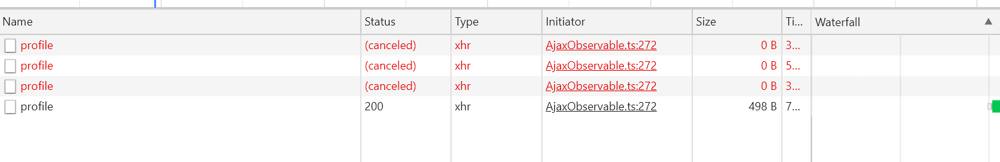

# hahow-frontend-assessment


[](https://app.netlify.com/sites/hahow-frontend-assessment/deploys)

- [題目快照](https://github.com/hahow/hahow-recruit/blob/d9fbdc22adaeda36ecc5ed1a781c72e8f4f0866e/frontend.md)
- [Demo](https://yoychen.github.io/hahow-frontend-assessment/#/heroes)
- [Fancy version](https://fancy--hahow-frontend-assessment.netlify.app/#/heroes) (in `fancy` branch)

## 如何執行

本專案使用 [Create React App](https://github.com/facebook/create-react-app) 來建置 React 的開發環境，以省去花時間在設定 webpack、babel 等開發環境上，更多如何開發、建置專案的細節請看 [CONTRIBUTING.md](./CONTRIBUTING.md)。

### Quick Start

```shell
npm i
npm start
```

## 架構規劃

### 目錄結構設計

主要實作的程式碼位於 `/src` 目錄中。

- `/api`
  - 包裝專案中需要使用的外部 api 呼叫
  - `$` 結尾是 RxJS 的 Observable 資料型態的命名慣例
- `/components`
  - React components
  - 負責專案的畫面的呈現與使用者交互的處理
- `/pages`
  - Page-level React components
  - 負責頁面層級的畫面渲染與 routing 相關邏輯的處理
- `/slices`
  - Redux 相關的邏輯 (action creators、reducers、epics)
  - 負責專案的狀態管理與狀態相關的副作用邏輯描述
- `/utils`
  - helper 方法
- `/tests`
  - `/components`
    - React components 的測試
  - `/slices`
    - redusers 與 epics 的測試

### Components

盡量以 dump components 的策略 ([Dumb Components and Smart Components](https://medium.com/@thejasonfile/dumb-components-and-smart-components-e7b33a698d43)) 撰寫專案的 React components，將應用的狀態與狀態相關的邏輯抽離，僅專注於定義資料的畫面呈現與使用者交互的處理。

本專案 Smart Components 的定義：使用 `react-redux` 的 `connect()` 所定義的 HOC 節點。

### 狀態管理

本專案使用 Redux 來管理應用的狀態，開發上有別於以往以 Redux 中的角色做為檔案的切分方式 (如 `/reducers`, `/actions`)，本專案使用資源的類型作為檔案的切分方式 (見 `/slices` 目錄)。

- 使用 redux-toolkit 的 `createSlice()` 來定義不同資源的 reducer 與 action creators
  - 透過 redux-toolkit 提供的 `createReducer()`，reducer 可用 mutation 的方式描述狀態的變化，並能保持狀態之間仍是 immutable (背後原理是使用 `immer.js`，詳見 [Redux Toolkit - createReducer()](https://redux-toolkit.js.org/api/createReducer#direct-state-mutation))
- 每個資源檔案皆會 export 出該資源的 root reducer 與 action creators

#### 採用的資源狀態慣例

因為該專案的規模與需求較小，且沒有特別指定發生錯誤時的畫面呈現規則，因此本專案在資源狀態的設計上沒有額外定義 `isFetching`, `error` 等狀態欄位，以下是本專案對於資源狀態的慣例規則。

以列表資源為例：

- `null` => 資源正在載入中，畫面可能呈現的方式為顯示載入的圖示或是 Skeleton Screen
- `[]` => 資源已載入完成，但列表為空，畫面可能呈現的方式為顯示空白狀態的設計畫面 (若有提供對應的設計稿)
- `[...]` => 資源已載入完成，且列表有資料，呈現列表

### 副作用/非同步邏輯

本專案使用 [`redux-observable`](https://redux-observable.js.org/) 來描述狀態相關的非同步邏輯，與常見的 `redux-thunk` 的 imperative 開發方式相比，透過使用 RxJS 提供的高抽象層級的 API，以 declarative 的方式定義非同步邏輯，可以使程式碼更佳簡潔並可以更優雅處理複雜的非同步行為。

### 測試策略

- 一個 test case 只測試一個關注點，各個 test case 皆可以獨立執行
- 使用 AAA (Arrange, Act & Assert) 模式描述 test case
- 使用工廠方法建立待測項目，避免濫用全域狀態與 beforeEach
- 使用專屬的 data-testid 定位元素，而非直接相依 CSS selector，以避免重構時若改動到 CSS 結構而影響測試穩定度
- 盡量使用 stub 來隔離外部相依，並盡量以測試待測對象的外部行為與狀態為主，以避免過度濫用 mock 而造成 overspecification

## 第三方 library 的使用及功能簡介

### devDependencies:

- `eslint-config-airbnb`
  - 本專案使用 eslint 做為 code style 的檢查工具，並套用較為嚴格的 airbnb rules 以避免寫出容易混淆或脆弱的程式碼 patterns
- `prettier`
  - 如其官網中的介紹，`prettier` 是一套 Opinionated 的程式碼自動排版工具，也正如同介紹的一樣，雖然他提供的預設排版規則不一定符合團隊的風格 (如其[設計哲學](https://prettier.io/docs/en/option-philosophy.html))，但因其 Zero Configuration 的特色以及支援大多數前端開發上所需的格式，而深受多數團隊導入使用
    - JS
    - JSX
    - SCSS
    - styled-components
    - JSON
    - Markdown
    - ...
  - Linters 是提供程式碼的 Formatting rules 及 Code-quality rules 的檢查，而 `prettier` 是專注於 Formatting rules 的自動化排版，故其角色並不會與本專案使用的 `eslint` 衝突
- `react-app-rewired`

  - 由 react 社群所提供的第三方工具，可做到無須將 `create-react-app` 內部的設定檔 eject 出來便可額外調整與擴充 Webpack 設定
  - 本專案用它來設定用於開發階段的 Hot Reload (詳見 [config-overrides.js](./config-overrides.js))

- `husky` and `lint-staged`
  - `husky` 用於讓我們更方便為專案設置 git hooks，本專案搭配 `lint-staged` 來讓開發者在 commit 前會自動對 staged 的程式碼進行 `eslint` 的檢查

### dependencies:

- `react`
  - 當前主流的複雜前端使用者介面開發的解決方案之一，特色是以宣告式的寫法定義資料 (狀態) 於畫面上的呈現以及處理使用者交互，並透過 Virtual DOM 的機制以找出渲染畫面上開銷相對低的修改方式
  - 與 `Vue.js` 小比較
    - 因為兩個解決方案我皆有稍微涉略，在此分享個人覺得兩者在實作上最大差異的淺見
    - `Vue.js` 的狀態是 mutable 的，背後透過響應的機制 (`Vue.js` 2.x 是使用 `defineProperty()`，3.x 則改用 `Proxy` 實作) 可更精準地找出狀態變化的屬性欄位，故可以在狀態變化後精準知道那些元件有用到該欄位而需要重新建立 VDOM，進而減少在 VDOM Diff 上的開銷，缺點是如果遇到資料非常龐大的狀態，在初始建立時因為需要遞迴執行 `defineProperty()` (`Vue.js` 2.x) 故首屏的渲染上會比較耗時
    - 在 `React` 開發上，若開發者沒有額外對 component 做渲染效能的調校 (`PureComponent`, `shouldComponentUpdate`)，當父節點狀態更新時，除了 React Reconciliation 機制中判定無須 rerender 的少數特例外，子節點的 components 皆會執行 render function 生成新的 VDOM，因此在大型複雜的畫面上可能會造成不小的開銷，故 `React` 在狀態設計上希望開發者以 immutable 的方式更新狀態，除了可以更好的追蹤與管理狀態，在部分情境下還可在有效能瓶頸的節點上使用前面提到的 `PureComponent`, `shouldComponentUpdate` 等方式，對於 rerender 進行效能優化
- `redux`
  - Flux-like 的狀態管理解決方案，Single source of ture 的設計原則可以讓我們更集中管理應用的狀態，並確保狀態的一致性；搭配 `react-redux` 使狀態可以與 react 進行整合，除了可以集中管理應用的狀態、避免將狀態一層一層傳遞外，也可讓狀態相關的領域邏輯與非同步行為從 React components 中抽離出來。
- `@reduxjs/toolkit`
  - Redux 官方提供的工具集，內容收錄官方精選的好用 utils，如本專案使用的 `createSlice()` (詳見 [狀態管理](#狀態管理))
- `react-router-dom`
  - 前端路由的解決方案，因為 demo 是部署於 GitHub page，故本專案選用不需要額外設置後端環境即可運作的 `HashRouter`
- `react-toastify`
  - React 的 notification ui 套件
- `redux-observable` and `rxjs`
  - redux 生態圈中其中一種處理非同步 action 的解決方案，使用 RxJS 提供的高抽象層級的 API，以 declarative 的方式定義非同步邏輯，可以使程式碼更佳簡潔並可以更優雅處理複雜的非同步行為
- `styled-components`
  - React 生態圈中其中一種 CSS-in-JS 的解決方案，比起知名 React ui framework `material-ui` 所使用的 CSS-in-JS 解決方案 `JSS` (使用 JS 的 literal object 來定義元件的樣式)，以 ES6 模板字串撰寫 css 的方式不僅更直覺好寫，因為本質還是 JS，一樣也可以享有使用表達式定義樣式值的好處，其背後所使用 HOC 的實作也可以方便對元件樣式進行擴展
- `@testing-library/react`
  - 一套前端測試的 utils，由於他僅提供 DOM 層級的畫面呈現及觸發事件相關 API，不像另一套 React 的測試 utils `Enzyme` 可以對 components 進行 shallow mount，以及使用 Wrapper 存取 components 實例的 props 與 state，但這些限制可以讓開發者更專注於測試 components 的外部呈現與行為，避免寫出過度測試實作細節的脆弱測試 (overspecification)

## 寫註解的原則

盡量以良好的命名、程式碼的編排、職責的切分等方式增加程式碼的可讀性來取代撰寫註解；若該問題的解決方式較為特殊，或是有些訊息或可能遇到的問題並非能透過閱讀程式碼而可直接理解，是我認為需要寫註解最佳時機。

## 專案中遇到的困難、問題，以及解決的方法

這邊除了紀錄開發中遇到的問題外，也會分享開發時的一些心路歷程，及設計上的想法。

### Hero List 的排版方式

考慮該專案的規模與所需輸入元件複雜度較小，故沒有額外使用第三方 ui framework，而是選擇搭配 `styled-components` 自己刻所需的排版與樣式；在 Hero List 的實作上原先想使用 flex box 搭配 `justify-content: space-between; flex-wrap: wrap;` 來實現，但在畫面的呈現上會因為不同裝置的螢幕尺寸而導致卡片之間的邊距沒有很一致，甚至在一些螢幕尺寸下的邊距寬度沒有很美觀，因此最後選擇使用常見 grid system 方式來排版，中斷點的定義參考 bootstrap，並自己實作簡易的排版元件，在實作過程讓我更加深刻了解 mobile first 的設計風格，在實作上會先定義最小螢幕尺寸的畫面呈現樣式，在漸漸加上大螢幕尺寸的畫面呈現樣式，因此在實作上不會出現 `@media (min-width: 756px) and (min-width: 991px)` 這種定義包含最大寬度值的 media query 寫法，且在中斷點的變數定義上也只需要定義不同螢幕尺寸的最小寬度值。

### Hero Card 的連結設計

為了讓使用者在點擊 Hero Card 進入 Hero Profile (`/heroes/:heroId`) 後還可以回到 Hero List 的路由 (`/heroes`)，本專案在 Hero List 的實作上選擇不使用 react router 的 `<Link>` 來建立前往 Hero Profile 路由的連結，而是將 Hero List 的 component 加上 `onHeroSelect` props，將被使用者選擇的 Hero 之 ID 傳給 parent component，由 parent component 決定如何處理的英雄被使用者選擇的事件。

以 Heroes Page 為例 ([Heroes.jsx](./src/pages/Heroes.jsx))，他會判斷使用者選擇的 Hero 是否是當前 Hero Profile 正在編輯的 Hero，若是則回到 Hero List 的路由。

### Profile 狀態的清空時機與合適的作法

原先在從 Hero Profile 回到 Hero List 路由時，因為沒有特別將 Redux Store 中的 profile 資料清除，故在使用者再次點選 Hero 進入 Hero Profile 時，會先渲染出過去點選的 Hero 的 profile 畫面後，才會清空畫面，渲染載入中的畫面，因此需要在回到 Hero List 頁面時，或是其他更適合的位置加上清空 Profile 狀態的邏輯，以下紀錄我當時列出可行的做法與評估該作法是否合適的考量原因。

#### 1. 在回到 Hero List 頁面的邏輯前加上清空 Profile 狀態的邏輯 (X)

目前是在 Heroes Page 的 component 中判斷應該前往其他 Hero Profile 路由還是回到 Hero List 路由，因可以在回到 Hero List 頁面的邏輯前加上清空 Profile 狀態的邏輯，但這樣的做法會導致切換路由的邏輯中混雜不相關的 redux 狀態調整邏輯，因此該作法個人覺得不合適。

#### 2. 改使用 `useLayoutEffect()` 取代 `useEffect()` 來執行非同步的 fetchProfile Action (X)

若該 component 是使用 class component 的 API 來定義，並在 `componentDidMount()` 的 Hook 執行非同步的 fetchProfile Action，便不會出現這個問題，雖然 React 還是會生成出過去點選的 Hero 的 profile 畫面之 VDOM，但由於 `componentDidMount()` 呼叫的時機會是在同一個 Macrotask 中，故他會重新呼叫 render function 生成載入中的畫面，最終 browser 只會繪製載入中的畫面，而 Hooks 中的 `useEffect()` 在設計上為了避免執行過多的邏輯而阻礙畫面渲染，故會是在下一個 Macrotask 才被呼叫，中間會經歷一次的 browser 畫面繪製，因此使用者才會看到先渲染出過去點選的 Hero 的 profile 畫面後，才會清空畫面，渲染載入中的畫面 (更多細節可看下面附圖中的 Devtool Performance 的比較)，因此只要將 `Profile.jsx` 中的 `useEffect()` 改為 `useLayoutEffect()`，便可以解決，但這樣的作法若沒有特別留下使用 `useLayoutEffect()` 的相關原因註解會使後續維護者產生困惑，也使專案中的組件呼叫 API 的時機點不夠一致，因此最後沒有使用這個方法。


#### 3. 使用 `useEffect()` 的 Effect 管理機制 (O)

`useEffect()` 在設計上提出一種新的 Side effect 邏輯組織的做法與思維以解決在使用 component 的生命週期來撰寫對應的 Side effect 邏輯時，所導致的成對 Side effect 邏輯分散在不同生命週期函數中的問題；`useEffect()` 中的 callback 可以回傳該 Effect 的清除函數，以供 component 要執行下個 Effect 前 (指定的 props 改變時) 或是 component 將被 unmount 時呼叫，因此 Effect 的清除函數是我認為最適合呼叫清空 Profile 狀態的時機。

### 使用 Redux Observable 處理非同步的 API 請求與使用 Marble Diagram 撰寫測試

在非同步的 API 請求處理上，以 Hero Profile 的實作為例，在網路環境較慢的情況下，若使用者頻繁切換要編輯的 Hero，則會發生之前發出的 Hero Profile 請求在完成後已經不是當前需要的資料，還將該資料呈現於元件的畫面上，這個問題不容易使用 `redux-thunk` 來解決，但若使用 `redux-observable` 則可以使用 `switchMap` operator 來解決，他只會訂閱最新生成的 API 請求的 Observable，若之前的請求還尚未完成，則會在解訂閱時將請求取消 (使用 `'rxjs/ajax`)，且在測試上還可以使用 `rxjs/testing` 提供的 `TestScheduler`，以 Marble Diagram 的方式描述非同步的行為 ([epics.spec.js](./src/tests/slices/profile/epics.spec.js))，輕鬆測試非同步的 RxJS 邏輯。


